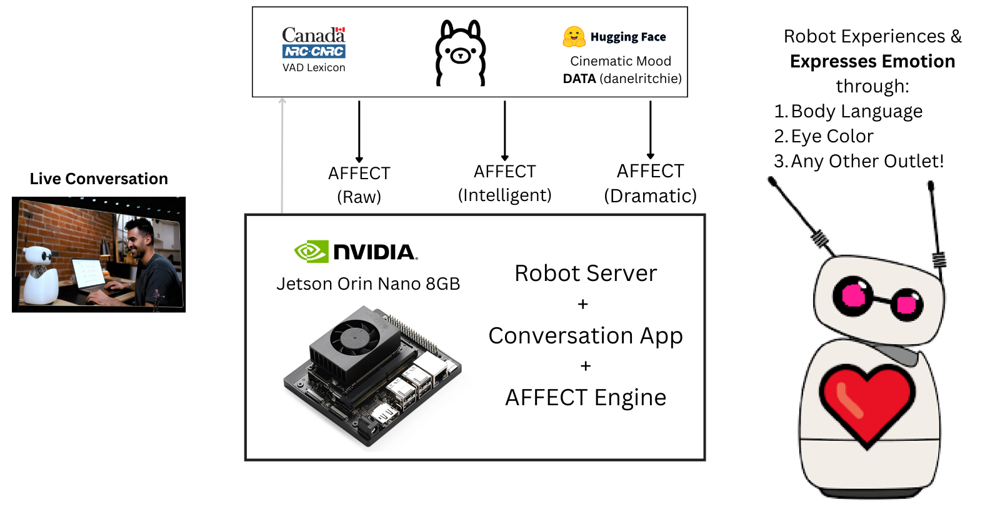
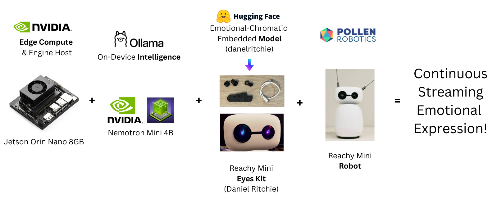

# Affection.

One of the joys of being human is our rich emotional experience, and the many ways we are able to express our internal feelings.

Robots have limited means for communicating, let alone understanding thier own experience. Affection delivers an **edge powered affect-engine** that runs on local robot hardware.

**Your robot already has a voice you can hear. Affection gives your robot feelings to experience.**

*An open source, open weights, and open data project built on NVIDIA Jetson, Ollama, and Hugging Face for the Reachy Mini by Pollen Robotics.*

## Why this is hard

Words are a weak signal of emotional state, and robots have limited means for displaying emotion. Emotion science is subtle. Bridging the gap in real time, without a round-trip to the cloud, smoothly, without missing a micro changes, requires a new way of extracting emotion from language and translating it into something meaningful... while rendering at the edge fast enough to maintain the illusion that a machine is having an experience.

## What was built

What is not felt cannot be communicated. If there is nothing experienced there is nothing to express. **Affection understands speech as it is spoken, amplifies and emotional content and translates into mood, and defines a rich dynamic expereience that can be expressed through any outlet.** Although output can be consumed for any purpose, our example uses cinematic color to communicate feelings.

This project extends the **Reachy Mini robot by Pollen Robotics** (or any other robot) with embedded ML hardware, multi-layer systems design, and artistic insight to express realtime edge emotion: 
 - The backbone is a tiny edge powerhouse **NVIDIA Jetson Orin Nano 8GB Dev Kit** 
 - Local LLM inference is **NVIDIA Nemotron** provided by **Ollama** (nemotron-mini:4b-instruct-q5_K_M)
 - Cinematic [dataset](https://huggingface.co/datasets/danielritchie/cinematic-mood-palette), [model weights](https://huggingface.co/danielritchie/vibe-color-model), and [space](https://huggingface.co/spaces/danielritchie/generative-affect-engine) published to **Hugging Face** 🤗
 - Interactive dialogue generated by fork of [Reachy Mini Conversation App](https://github.com/brainwavecollective/reachy_mini_conversation_app/tree/Affection) by **Pollen Robotics**
 - Mood derived from **realtime emotional affect extraction engine** with **cinematic amplification** *(THIS REPO)*
 - Color displayed through a [physical device](https://github.com/brainwavecollective/reachy-eyes/) with engineered electronics, compiled firmware, and an embedded ML model



## Why it matters

**This project enables robots to generate coherent emotional expressions.**

Affection backs big claims with a working, tuned, end-to-end system, encompassing affective computing, real-time inference, HRI (human–robot interaction), and edge rendering.

**Edge compute is ready for emotional intelligence.**

You don't need a cloud round-trip for nuanced, real-time affect understanding and expression. One of NVIDIA's smallest edge devices provides the entirety of compute necessary to power the full local robotic experience, and readily handles realtime interactive robotics applications with multi-level loops, dynamic inference, as well as cinematic translation and display.

**Expressive hardware is accessible.**

Although the example in this project uses an external embedded device, the 8GB NVIDIA Jetson Orin Nano has more than enough exceess capacity to directly take on the workload of multiple outputs. The embedded device proves that a small, inexpensive add-on can fundamentally change the experience of interacting with a robot. Plug in the expressive module, allow the engine to identify and express feelings, and add life to an existing robot through any outlet. 

**The affect-engine is fully decoupled. Eye color is only one possible application.**

Affection provides the emotional understanding. Generalized output vectors can be mapped to any expression such as movement, ambient lighting, sound, haptics, or for any other purpose. 

## Full load performance
**Procs:** Reachy Mini Daemon / Affect Extraction Engine / Reachy Mini Conversation App   
**Config:** MAXN_SUPER, jetson_clocks, OS on 64GB SD, running graphical.target  

| Metric                   | Sustained / Peak                     |
|--------------------------|--------------------------------------|
| Power                    | ~11W / 20W peak (80% of 25W budget)  |
| CPU                      | ~55% overall 1 core @ ~100% (1728MHz)|
| GPU                      | ~12% / 99% bursts (1020MHz)          |
| Temperature              | 56–59°C (≈40°C below 100°C tjmax)    |
| RAM                      | 6.1GB of 7.6GB w/~1.8GB swap utilized|
| Fast Loop Color Render   | < 5ms                                |
| Slow Loop Color Render   | 1.6–1.8s                             |


## How it works

Affection bridges three interconnected layers: language understanding at the edge, interpretive display within embedded hardware, and embodied presence in physical robotics.


 
### EDGE: Conversational Input & Realtime Emotion Extraction Engine 

Affection is optimized for edge cognition. Although the robot's words may originate from any source (E.g., Generative speech from NVIDIA's PersonaPlex, or OpenAI's Realtime API), everything that follows happens locally.

Small [modifications to the Reachy Mini Conversational App](https://github.com/pollen-robotics/reachy_mini_conversation_app/compare/develop...brainwavecollective:reachy_mini_conversation_app:Affection) enable the text transcript to be sent to the affect engine.

Emotional state is derived using an extension of the well-established VAD model (Valence, Arousal, Dominance) with two additional dimensions for style: Complexity and Coherence.

Understanding is built in two loops. A limbic **fast loop** scores each sentence as it is spoken, capturing momentary emotional bursts. A reflective **slow loop** runs a local LLM (4B Nemotron Mini from Ollama) as background affective baseline recalculation. This allows for both precise understanding as well as subjective interpretaion. The two are blended in real time so the eyes respond to emotional spikes while maintaining the general feel of the conversation. The immediate reactive emotion is expressed, and then we reflect and refine.

Weak emotional signals are amplified and optionally aligned with established cinematic mood. A tunable "drama knob" let's a user choose how much to rely on predefined emotionally weighted visual anchors (Range: raw truth, to total cinematic license, and beyond to extreme exaggeration). 

Fast loop scores and displays color in under 5ms. The slow loop completes in 1.6–1.8s. Both loops are non-blocking with continuous integration and state-based reconciliation.

For a detailed breakdown of this extraction pipeline, see the [Affect Engine overview](EMOTION_ENGINE.md). 

### EMBEDDED: Interpretive Display

Knowing is not the same as expressing, and even the world's cutest robot has limited options for displaying emotion. The engine interfaces directly with ([Reachy Mini Eyes](https://reachyeyes.brainwavecollective.ai/), a small, inexpensive, and now commercially available device I created as member of the Pollen Robotics community).

To map emotional state to color we draw from how filmmakers use light and color to express mood. See: [Cinematic Mood Data Notes](DATA_CURATION.md) for a deeper dive into that approach. This allowed the creation of a simple model that understands how to express color using only a limited representation of the conversation (VAD+CC). Rust-based firmware delivers deterministic low-latency execution with a 1kHz polling loop, pulling and displaying emotional state as commands arrive.

With this understanding available on-device, the user does not have to decide how to communicate for the robot. The engine identifies emotional mood in realtime, and the eyes themselves convert raw feelings into believable colors.

### EMBODIED: Physical Presence

Expression only becomes meaningful when it is experienced in a way that is fully integrated. In Affection, emotional vectors computed at the edge and interpreted in embedded firmware are ultimately rendered as dynamically expressive eyes for the Reachy Mini robot.

Color is not decorative, but behavioral. Subtle shifts reflect conversational tone. Emotional spikes create visible transitions. Cinematic amplification shapes perceived mood. Because the emotional engine is fully decoupled from interpretation and display, eye color is just one embodiment channel. The same vectors could easily be used to drive ambient lighting, motion, sound, haptics, or any other creative outlet.

Language defines experience.  
Affect establishes signal.  
Signal becomes presence.  

## DEMO - NO HARDWARE REQUIRED
Although the system is extremely easy to run, not everyone will have the necessary hardware on hand to run this system, an [interactive Hugging Face space](https://huggingface.co/spaces/danielritchie/generative-affect-engine) has been launched to help demonstrate how this system works.

---
	
## Full system setup

###  Physical Hardware
This example expects that you will have the following physical devices:
 - Reachy Mini
 - Reachy Mini Eyes (v0.3.1+)
 - NVIDIA Jetson Orin Nano (r36.5+)

Follow the standard instructions for the Reachy Mini and Reachy Mini Eyes. 

Follow the [Affection edge setup guide for the NVIDIA Jetson Orin Nano](EDGE_SETUP.md) for hardware and system configuration.

### Run the code 

Run these processes in **3 separate terminals**:
```
# Run the Reachy Mini Server
cd <...github...>/pollen-robotics/reachy-mini
uv run reachy-mini-daemon 
```

```
# Run the Affection Emotional Extraction Engine 
cd <...github...>/brainwavecollective/affection
uvicorn vibe_eyes.server:app --host 0.0.0.0 --port 8001
```

```
# Run the Reachy Mini Realtime Conversational Application
cd <...github...>/brainwavecollective/reachy_mini_conversation_app
git checkout Affection 
uv run reachy-mini-conversation-app
```

Everything is automatic and fully integrated so nothing else is necessary. 

As you talk to your robot the eyes will change colors based on the nature of the conversation.

See an example of this in action here: 
<VIDEO>


## For Developers
See the [Developer Guide](DEVELOPER_GUIDE.md) for API usage and integration details.


## Acknowledgements

This project uses the NRC Valence, Arousal, and Dominance (VAD) Lexicon (v2.1) created by Saif M. Mohammad at the National Research Council Canada.

If you use this project in academic work, please cite:
Mohammad, Saif M. (2025). NRC VAD Lexicon v2: Norms for Valence, Arousal, and Dominance for over 55k English Terms. arXiv:2503.23547.


## About the Author
Daniel Ritchie is the inventor/manufacturer of [Reachy Mini Eyes](https://reachyeyes.brainwavecollective.ai/), and the creator of the Affection project. He is an independent technologist and founder of the Brain Wave Collective. This project is not affiliated with Hugging Face or Pollen Robotics.  

**Contact Daniel with your ambitious project needs**  
[LinkedIn](https://linkedin.com/in/danielritchie123)  
[Email](mailto:daniel@brainwavecollective.ai)  
[Pollen Robotics Discord](https://discord.gg/tPy7cRU8he) (I am @LeDaniel)
